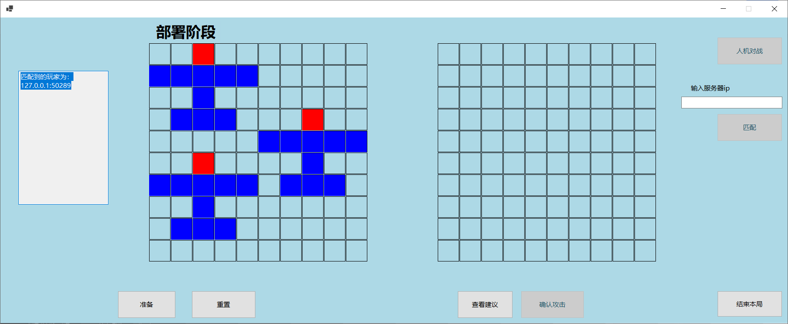

## C#课程设计：使用套接字实现一个炸飞机游戏应用程序

### 摘要

    本次C#课程设计要求设计一款炸飞机游戏。

炸飞机是一款规则简单，上手容易，但是需要进行博弈和思考的推理游戏，主要通过炸取区格得到的信息“空，伤，沉”来判断对方飞机的摆放位置，最先将对方飞机击沉的人获胜。

    具体的规则为：

两个人，在纸上画10*10的格子，然后各自在格子上画三个飞机形状，飞机的结构是1513：飞机头1个格、机翅5个格、机翅机尾连接1个格，机尾3个格，可以调整方向。

    一般都是准备两个10×10的方格，一个画自己的飞机，一个留着打对方飞机时用。画好后，双方喊坐标。

    例如对方喊3-5，就是指纵向第三行，横向第五格，那个位置，如果正好打到飞机机身了，就叫“中”或叫“伤”，打不到叫“空”，如果打到机头叫“死”，但是有些飞机即使死了也可以迷惑对方一会，如果三架飞机都打死了，就算胜利。

### 1)介绍

**游戏界面如下**

* 游戏界面的主要控件及功能如下：
  * 左侧状态栏：显示当前已和哪些玩家连接，如果成功连接会显示另一玩家的IP地址，同时也可以通过此栏查看是否成功与服务器建立连接
  * 两个网格：左侧为己方地图，用于布置己方飞机，右侧为敌方地图用于攻击敌方
  * 准备按钮：表示当前已经布置好己方所有飞机，向服务器发送就绪的信息
  * 重置：当不满意飞机的布置或需重新布置飞机时点击改按钮即可，己方地图会进行重置
  * 查看建议：利用辅助猜想功能获取下一步的推荐走法
  * 确认攻击：在右侧网格用鼠标点击某一个坐标时，为预选择状态，仅显示为灰色，当点击确认攻击按钮时，才会显示攻击反馈
  * 人机对战：和AI进行对战，AI会自动布置其飞机并攻击我方飞机，且当一局游戏结束时再次点击该按钮会开始新游戏
  * 输入服务器IP和匹配按钮：在输入栏输入服务器IP以后并点击匹配，且连接到同一个服务器的玩家数为偶数个时，服务器会随机匹配这些玩家，使双方都进入部署阶段(各阶段见下方“游戏的各个阶段”描述)，双方准备完毕即可开始对战；若不输入IP，直接点击匹配，则默认服务器地址为本机地址，同样会等待本机上另一玩家也连接到服务器
  * 结束本局：在游戏过程中可以随时点击该按钮以结束本局游戏,视为该玩家投降
* 游戏的各个阶段及游玩流程：
  * 初始阶段：该阶段为打开游戏时的初始界面
  * 
  * 匹配阶段：该阶段为输入服务器IP，输入ip之后点击匹配按钮时等待与另一个玩家匹配的状态
  * 
  * 部署阶段：当匹配到另一玩家时即进入该阶段，双方可以开始布置各自的飞机位置，布置飞机方法为首先选择机头的位置，然后再选择机身的方向，如果选择错误点击重置即可
  * 
  * 游戏阶段：当飞机部署完毕，点击准备按钮，且对方也执行同样的操作后进入本阶段以进行游戏。游玩的说明为在右侧网格选择攻击坐标，或者通过点击查看建议，右侧网格会显示点击或者建议之后的格子，如果确定攻击此格子，则再点击确认攻击
    * ***处于攻击回合玩家的界面：***
    * 
    * ***等待对方攻击玩家的界面：***
    * 
  * 结束阶段：某一方飞机被全部击落时，双方都会进入的阶段
    * ***胜利一方的界面：***
    * 
    * ***失败一方的界面：***
  * 对于两个网格颜色的说明：
    * 己方网格：机头为 **红色** ，机身为 **蓝色** ，被击中的部分以**灰色**显示
    * 敌方网格：击中空地显示为黑色，击中机身显示为 **蓝色** ，击中机头显示为**红色**

### **2)需求说明**

1. 根据炸飞机游戏规则，实现对战功能
2. 实现辅助猜想对方飞机位置功能
3. 实现人与AI对战
4. 使用套接字进行通信
5. 实现一个用户的可视化界面，使得用户可以进行飞机位置摆放，与其他玩家匹配，提示用户信息，及后续正式游玩等操作

### 3)设计和实现

> 针对上述需求，每个需求的设计与实现如下：

* 对战功能：通过自定义一个通信双方互相了解的协议进行通信，利用该协议双方可以知道互相给对方传递的信息的内容，如棋盘信息或者攻击坐标等，信息由服务端转发，详细见下方过程分析的描述。
* 辅助猜想对方飞机位置功能：将所有飞机可能的摆放都保存下来，然后每一次决策决定一个位置进行攻击，该决策由当前局面和可能的选择共同决定和该选择的收益大小进行判断，直到找到对方所有的机头为止，详细分析见下方过程分析描述。
* AI对战功能：通过配合辅助猜想对方飞机位置的功能，人机能够实现自动摆放飞机并准备，每一步的决策由辅助猜想功能给出，使用该功能无需进行联网。
* 套接字通信：采用一对多的方式，使用一个服务端和多个客户端进行通信，并将计算负担(主要为AI计算辅助猜想敌方飞机位置和对收到信息的处理，更新地图等操作)下放至客户端中，服务端仅作为信息的中转，通过使用自定义的协议，服务端依据该协议识别出客户端发来的信息，并将该信息传递给其所配对的客户端，服务端负责监管所有的客户端，并为每一个客户端声明一个通信线程，此外服务端通过一个字典的方式维护每一对匹配的玩家，每一次对于客户端的请求连接发送时都有一个原子操作，当且仅当接收到两个连接时才进行配对操作，只监听到一个请求链接时，服务端会进行阻塞，直到监听到第二个请求链接到来时，将两个链接作为两条记录并且双方互相作为对方的索引存入字典中，而后当双方需要传信息时，服务端只需要从词典中取出该玩家对应的索引即可轻松实现指定给指定客户端对应的套接字发送信息。
* UI实现：使用WinForm进行界面设计。

### 4)过程分析

1. 底层逻辑实现：

* ***游戏运行：***

首先，游戏能够正常进行所依赖的是Form1类中的一个属性：

static
int state = 0;该参数作为当前棋盘的用于状态判断的变量，负责表示当前对局进行的状态。 **如果state等于0** ，则说明当前该用户处于等待状态，棋盘不会响应用户的操作。此时可能处于没有进行对局或者处于等待对方进攻的状态。 **如果state等于1** ，则说明该对局处于部署状态，用户可以在己方的棋盘上进行飞机的部署。 **如果state等于2** ，则说明该用户处于选择进攻位置的状态，用户可以选择进攻的坐标，当用户确定要攻击的时候，点击确认攻击即可，此时自动进入state=0的状态。

使用static int[,]
selfmat = new int[10, 10];表示自己的飞机矩阵，记录自己的飞机的部署情况。

selfmat有四种状态0, 1, 2, -1；

0是是初始态，仅作为逻辑处理中出现。

1是机头，为红色。

2是机身，蓝色。

-1是被击中的部分，灰色。

static int[,] enemymat = new
int[10, 10];表示己方显示的敌方矩阵（右边的棋盘）

敌方矩阵有三种状态

1表示打中机头，红色

2表示击中机身，蓝色

-1表示没有击中，黑色

static int[,] enemysetmat =
new int[10, 10];存储的是敌方部署矩阵，客户无法查看，用于攻击反馈。

这些矩阵颜色在执行protected override
void OnPaint(PaintEventArgs e)方法的时候进行更新。

Rectangle[]
selfrects; // 用于存储己方矩阵的矩形，全局变量，用来进行显示在界面上的，成员变量中的mat是用来维护状态的

Rectangle[]
enemyrects; // 用于存储敌方矩阵的矩形，全局变量

* ***点击棋盘坐标的判定：***

    用户可以点击棋盘的时候，通过void OnMouseDown(objectsender, MouseEventArgs e)来检测鼠标点击的坐标，调用方法Contains(e.X, e.Y), 来		判断鼠标是否落在某个矩形中，这个矩形中的坐标可以映射在存储棋盘信息的数据结构中的坐标，以便进行更新。

* ***客户端与服务端之间的通讯：***

    客户端之间无法直接通讯，客户端需要通过服务器间接与其他客户端进行通信，服务端与客户端进行一对多的通信。

由于每次传输的信息不同，有的时候可能只是简单的指令，每次进行资源的判断显然过于浪费资源。为此，自定义了一个通讯协议，确保指令的执行以及信息的传输无误。

该指令的格式为：指令（字符串）+
";" +信息（字符串）

其中，中间的分号充当分隔符的功能，前边是指令，后边是传输的信息。值得注意的是，消息可以为空，因为有时候只需要传输一个指令即可。

整个指令由字符串构成，每次只需要传输和接受字符串即可。不需要进行数据类型的判断以及可以快速将指令和传输的信息分离。统一了协议保证了对局的正常进行。

客户端通过private void
recv()方法，建立一个监听线程，其中包含了指令表，来达到接受服务器指令并控制己方战局的目的。

指令表如下：

传向服务器的数据

1：开始匹配（用户端开始匹配）

2：放置完成，准备好了

3：棋盘信息（后边的信息是棋盘的数组，通过.进行分割每个数字）

4：攻击信息（后边的信息是攻击坐标）

5：失败（退出或者没血了）

服务器传回的信息

1：匹配成功，可以开始部署了

2：游戏终止（有一方退出游戏）

3：两边都准备好了，可以开始了（传输棋盘）

4：接收敌方棋盘（后边的信息是棋盘的数组，通过.进行分割每个数字）

41：接受敌方棋盘并进攻（先手的用户，接收完棋盘可以直接进攻了）

5：本机进攻（服务器通知该客户端可以进行进攻了）

6：本机被攻击（后边的信息是被攻击的坐标）

7：胜利（对方投降或者被击坠）

* ***对局流程：***

一次正常的对局，用户会分别处于部署，进攻，等待进攻，对局结束四个状态。

    **部署：**

当用户点击匹配或者人机对战，系统会生成一个ArtificialIntelligence类的对象（该对象可以通过每次攻击反馈的结果，来进行模拟剪枝，通过深度遍历的方法来做到预测下一步）。如果用户点击的是匹配，则系统根据输入服务器ip连接服务器，如果没用玩家进行匹配，则进行等待，直到另一个玩家进行匹配。

匹配到对手之后，服务器会统一发送指令（详见客户端之间的通讯）通知对剧中的两个客户端可以进行部署了。用户部署之后，点击准备，互换棋盘信息。

    **进攻：**

用户在两种情况下可以进攻，第一种情况是收到指令41，说明为先手，设置状态为2，可以进攻。另一种情况是受到攻击但飞机未全部被击坠，此时状态设置为2，允许用户进行反击。用户选中一个空白的坐标之后，可以点击，此时该坐标会显示灰色表示选择，再点击确认攻击，此时会调用private int SendAttackMessage(int attackPos)函数来向服务器发送攻击坐标。

    **等待进攻：**

用户等待对方的进攻，此时状态state为0，用户无法操作棋盘。如果玩家接收到了对方的攻击指令，会调用private int Attacked(int
attackPos)函数，进行己方的棋盘更新。

    **对局结束：**

有一方退出或者一方飞机被全部击坠，此时该用户会向服务器发送指令5，服务器再通知另一方，然后进行socket连接的断开，避免浪费资源。此时用户会调用void EndGame(int type)函数进行数值的初始化，以便下一局的进行。

type的值会根据情况不同而不同，分为：

1人机对战获胜 2人机对战失败 3玩家对战获胜 4玩家对战失败

此时界面会保留对局的结果，直到重新开始一场对局才会重新清空。

* ***飞机的放置以及判断是否与其他飞机重叠：***

该系统的飞机放置分为机头坐标，和机身方向两个参数确定一个飞机。

   机头的坐标需要用户在部署阶段选择，如果选中的坐标是空的，则进行机头的显示，此时一个声明为static
int setstate;的属性变成2，表示下一次选择机身方向。用户再次点击己方部署区，会调用方法private int SetJudge(int direction)。

   该方法可以根据用户的机头和机身方向进行判断是否可以放这个飞机。如果可以放置，则调用private void SetPlane(int head,int direction)函数，该函数两个参数分别为机头坐标和方向坐标，来进行一架飞机的放置。如果用户放错了，可以点击重置按钮，系统会调用private void RePlace()方法进行重新放置。

    2.AI实现：

    AI的实现基于贪心算法的思想，对于一个决策而言，使得选择该决策以后能够排除更多的可能，即找到某一个期望收益最大的决策坐标以后，这个收益表示通过选择这个坐标进行轰炸以后能够减少的可能数目。

    对于每个轰炸位置，都有三种情况，假设击中空地，机身和机头的概率分别为p1，p2和p3，当前可能的情况构成的集合大小为N，则该决策所获得的期望收益就是：(用公式编辑器)，而每个概率可以通过枚举出每一种的可能来进行统计得出，需要注意的是每一个决策的步骤中的三个概率都是不同的。在执行完每一步之后，可以使用真实的结果去更新当前的局面和可能的集合，最终通过该方式迅速找出所有的机头

    实际实现中的一个细节，我们通过设置一个结构体，结构体保存了地图数组，每一种情况都有对应于该结构体的一个实例，那么就需要反复使用到二位数组的赋值，起初我们使用for循环进行数组进行赋值的时候，初始化的速度和中间枚举计算时都占耗费了大量时间，随后查阅资料发现通过二维数组自带的Array.Copy()方法能够迅速完成数组的赋值，通过该方式初始化的时间几乎缩减到无法感知的程度。

### 结论：

通过对应此程序的精心设计，该程序能够较好地实现需求里列出的各项功能，并且能够实现远程对战的功能，只需在某一台主机上打开服务端，在其他任意一个主机上运行一个客户端，并输入服务端的IP地址即可实现在线对战的功能，程序完成度较高。

### 参考：

[AI的参考链接](https://zhuanlan.zhihu.com/p/423834026)
